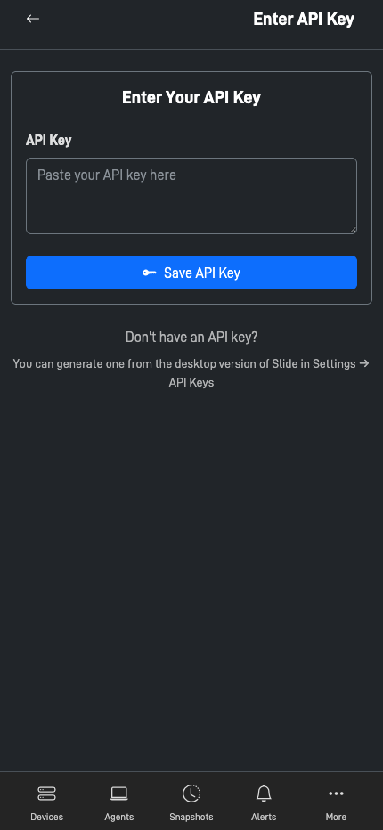
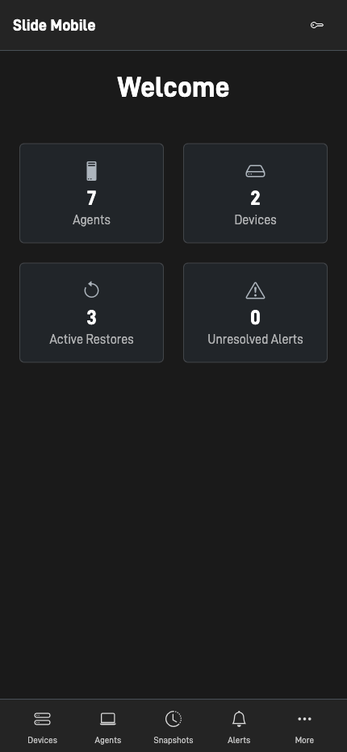
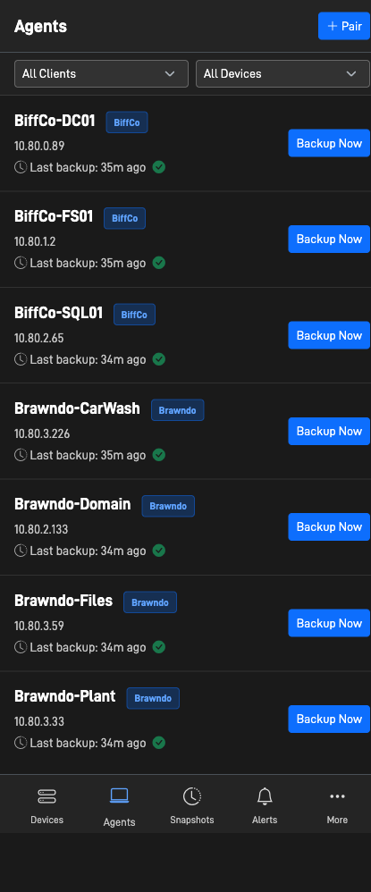
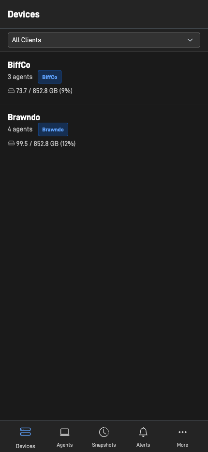
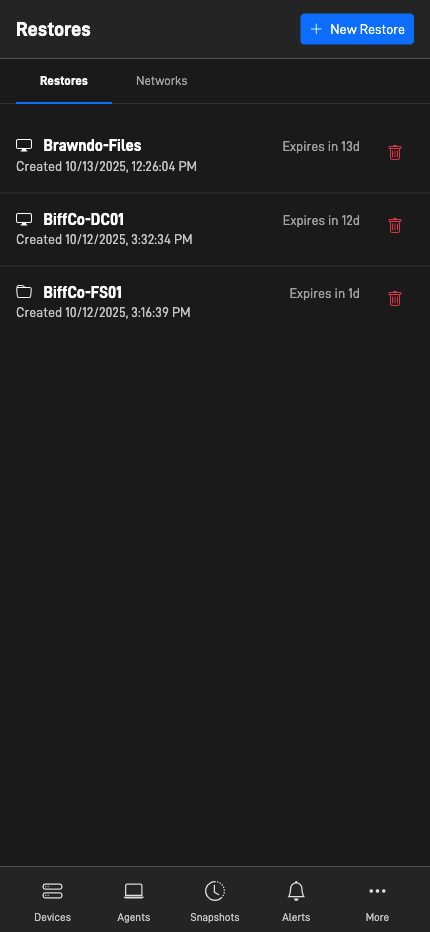
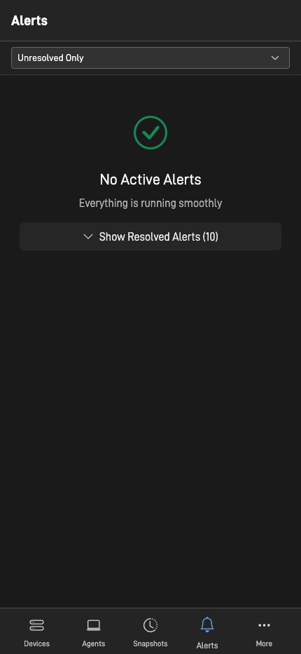
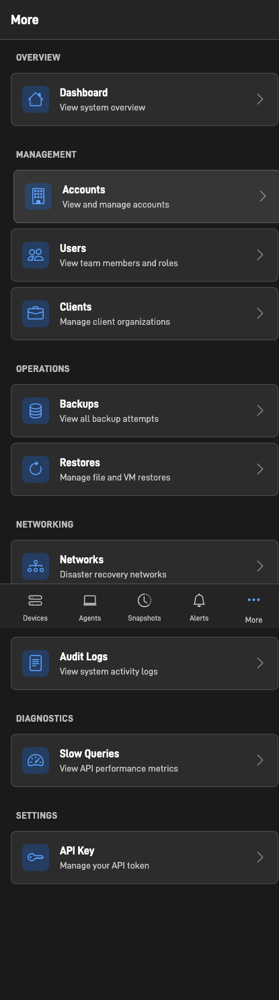
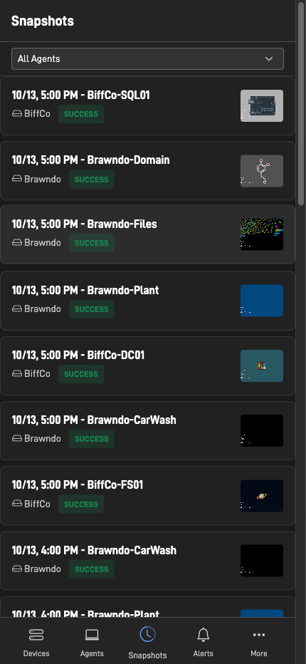

# Slide Mobile

A Progressive Web App (PWA) for managing Slide backup operations from mobile devices. This application provides a mobile-optimized interface for monitoring agents, managing backups, performing restores, and viewing snapshots.

## Features

- **Agent Management**: View and monitor backup agents, check status, and initiate backups
- **Snapshot Browser**: Browse and explore backup snapshots
- **Restore Operations**: Perform file restores, image exports, and virtual machine restores
- **Device Management**: Monitor and manage backup devices
- **Network Configuration**: Configure networks, IPsec tunnels, port forwarding, and WireGuard peers
- **Alert Monitoring**: View and resolve system alerts
- **VNC Access**: Remote desktop viewing through integrated noVNC viewer
- **Offline Support**: PWA capabilities for offline functionality
- **Dark Mode UI**: Modern, mobile-optimized dark theme interface

## Screenshots

### API Key Setup


Setup your API key using manual entry or QR code scanning.

### Dashboard


View overview of agents, devices, active restores, and unresolved alerts at a glance.

### Agents


Monitor all backup agents with status, last backup time, and boot verification.

### Devices


Manage backup devices and monitor storage usage.

### Active Restores


View and manage file restores, image exports, and virtual machine restores.

### Alerts


Monitor system alerts and resolve issues quickly.

### More Menu


Access additional features including accounts, users, clients, backups, networks, audit logs, and diagnostics.

### Snapshots


Browse backup snapshots with thumbnails for visual verification.

## Requirements

- PHP 7.4 or higher
- Apache or Nginx web server
- OpenSSL PHP extension (for encryption)
- cURL PHP extension (for API calls)
- Valid Slide API key

## Installation

### 1. Clone the Repository

```bash
git clone https://github.com/YOUR_USERNAME/slideMobile.git
cd slideMobile
```

### 2. Configure Encryption Key

Copy the example configuration file and set your encryption key:

```bash
cp include/config.example.php include/config.php
```

Edit `include/config.php` and replace `YOUR_SECURE_RANDOM_32_CHAR_KEY` with a secure random 32-character string.

To generate a secure key, you can use:

```bash
php -r "echo bin2hex(random_bytes(16));"
```

### 3. Configure Web Server

#### Apache

Ensure you have a `.htaccess` file or configure your virtual host to:
- Enable mod_rewrite (if using URL rewriting)
- Allow .htaccess overrides
- Set appropriate permissions

Example Apache configuration:

```apache
<VirtualHost *:80>
    ServerName mobile.yourserver.com
    DocumentRoot /path/to/slideMobile
    
    <Directory /path/to/slideMobile>
        AllowOverride All
        Require all granted
    </Directory>
</VirtualHost>
```

#### Nginx

Example Nginx configuration:

```nginx
server {
    listen 80;
    server_name mobile.yourserver.com;
    root /path/to/slideMobile;
    index index.php;

    location / {
        try_files $uri $uri/ /index.php?$query_string;
    }

    location ~ \.php$ {
        fastcgi_pass unix:/var/run/php/php7.4-fpm.sock;
        fastcgi_index index.php;
        fastcgi_param SCRIPT_FILENAME $document_root$fastcgi_script_name;
        include fastcgi_params;
    }
}
```

### 4. Set File Permissions

Ensure the web server has read access to all files:

```bash
chmod -R 755 .
chmod 600 include/config.php
```

### 5. Access the Application

Navigate to your configured URL (e.g., `http://mobile.yourserver.com`) and enter your Slide API key when prompted.

## Configuration

### API Key Setup

On first access, you will be prompted to enter your Slide API key. The key is encrypted using the `ENCRYPTION_KEY` from your `config.php` file and stored in a cookie.

You can manage your API key through:
- Key Management page (accessible via the key icon in the header)
- QR code scanning (for quick setup)
- Manual entry

### PWA Installation

The application can be installed as a Progressive Web App:

1. Open the application in a mobile browser (Chrome, Safari, etc.)
2. Look for the "Install" prompt or banner
3. Tap "Install" to add the app to your home screen

## Security

- **Encryption Key**: Keep your `ENCRYPTION_KEY` secure and never commit `include/config.php` to version control
- **API Key Storage**: API keys are encrypted using AES-256-CBC before being stored in cookies
- **HTTPS**: Use HTTPS in production to protect data in transit
- **File Permissions**: Ensure `config.php` has restricted permissions (600 or 400)

## Project Structure

```
mobile/
├── include/                # Shared includes and utilities
│   ├── config.php         # Configuration (not in git)
│   ├── config.example.php # Configuration template
│   ├── encryption.php     # Encryption utilities
│   ├── getApiKey.php      # API key retrieval
│   ├── bottomNav.php      # Bottom navigation component
│   └── pwa_head.php       # PWA meta tags and headers
├── css/                   # Stylesheets
├── js/                    # JavaScript files
├── pwa/                   # PWA assets (manifest, service worker, icons)
├── vendor/                # Third-party libraries (noVNC)
├── *.php                  # Application pages
└── mobileSlideApi.php     # API proxy to Slide backend
```

## API Integration

The application communicates with the Slide API at `https://api.slide.tech/v1/`. All API calls are proxied through `mobileSlideApi.php` which handles authentication and request formatting.

## Third-Party Libraries

- **Bootstrap 5**: UI framework
- **Bootstrap Icons**: Icon library
- **noVNC**: Remote desktop viewing

## Browser Support

- Chrome/Edge (recommended for PWA features)
- Safari (iOS and macOS)
- Firefox
- Modern mobile browsers

## Development

To contribute or modify the application:

1. Fork the repository
2. Create a feature branch
3. Make your changes
4. Test on multiple devices and browsers
5. Submit a pull request

## License

This project is licensed under the MIT License.

## Support

For issues, questions, or feature requests, please open an issue on the GitHub repository.

## Acknowledgments

- Built for Slide backup management platform
- Uses noVNC for remote desktop functionality
- Designed with mobile-first principles

